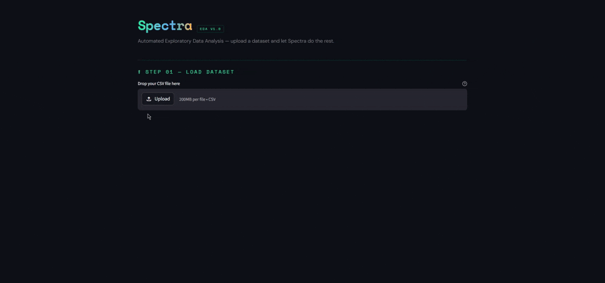

# 🔬 Spectra — AI-Powered EDA Platform


> Upload any CSV. Get instant statistical profiling, interactive visualizations, and natural language Q&A — all in one place.

---

## 📸 Demo

<!-- Add a GIF or screenshot of the app here -->


---

## 🧠 What is Spectra?

Spectra is a full-stack, deployed data science tool that automates the Exploratory Data Analysis (EDA) workflow. Instead of writing the same Pandas profiling code for every new dataset, Spectra handles it in seconds — statistical summaries, charts, and an AI assistant that answers questions about your data in plain English.

Built as a portfolio-grade project targeting the Indian DS job market — demonstrates end-to-end ownership from data layer to cloud deployment.

---

## ⚙️ Features

| Feature | Description |
|---|---|
| 📂 **CSV Upload** | Drag-and-drop upload with validation, shape and null profiling |
| 📊 **Statistical EDA** | Mean, median, std, skewness, kurtosis, missing % for numeric; cardinality, mode, frequency for categorical |
| 📈 **Interactive Viz** | Histogram, Bar, Scatter, Violin, Correlation Heatmap via Seaborn |
| 💬 **AI Chat** | LLaMA 3.3-70B (via Groq) answers natural language questions about your dataset |
| 🗄️ **Persistence** | Every upload logged to cloud MySQL (Aiven) with session tracking |
| ⬇️ **Export** | Download full EDA summary as CSV in one click |

---

## 🏗️ Architecture

```
spectra/
├── app/
│   ├── main.py                  # Streamlit entry point + global styles
│   └── components/
│       ├── uploader.py          # Step 01 — CSV upload + basic profile
│       ├── eda_display.py       # Step 02 — Statistical summary UI
│       ├── viz_display.py       # Step 03 — Visualization UI
│       └── chat_ui.py           # Step 04 — AI chat interface
├── src/
│   ├── data_loader.py           # CSV validation, loading, profiling
│   ├── eda_engine.py            # Numeric + categorical statistics engine
│   ├── viz_engine.py            # Seaborn/Matplotlib chart methods
│   ├── chat_engine.py           # Groq LLaMA chat with EDA context
│   └── db_manager.py            # MySQL CRUD operations
├── sql/
│   └── schema.sql               # uploads_info + reports table schema
├── tests/
│   └── fixtures/                # test_clean.csv, test_edge.csv, test_nulls.csv
├── .env.example                 # Environment variable template
├── requirements.txt
└── README.md
```

---

## 🧩 Core Classes

### `DataLoader`
Handles CSV upload validation, loading via Pandas, null profiling, and dtype detection.

### `EDAEngine`
Computes full statistical profile — separates numeric vs categorical columns and runs targeted analysis on each.

### `VisualizationEngine`
Wraps Seaborn/Matplotlib into clean methods. Returns `Figure` objects consumed by Streamlit's `st.pyplot()`.

### `ChatEngine`
Feeds EDA summaries as context to LLaMA 3.3-70B via Groq API. Maintains conversation history for multi-turn Q&A. Restricts LLM to dataset-related queries only.

### `MySQLManager`
Manages cloud MySQL connection (Aiven, SSL-enabled). Logs every upload with metadata and session ID. Designed for future report persistence via cloud storage.

---

## 🚀 Getting Started

### 1. Clone the repo
```bash
git clone https://github.com/Manglam11/spectra.git
cd spectra
```

### 2. Create virtual environment
```bash
python -m venv .venv
.venv\Scripts\activate        # Windows
source .venv/bin/activate     # Mac/Linux
```

### 3. Install dependencies
```bash
pip install -r requirements.txt
```

### 4. Set up environment variables
```bash
cp .env.example .env
```
Fill in your `.env`:
```
GROQ_API_KEY=your_groq_api_key
MYSQL_HOST=your_aiven_host
MYSQL_PORT=your_port
MYSQL_USER=avnadmin
MYSQL_PASSWORD=your_password
MYSQL_DATABASE=defaultdb
MYSQL_SSL_CA=ca.pem
```

> Download `ca.pem` from your Aiven service overview page and place it in the project root.

### 5. Run the app
```bash
streamlit run app/main.py
```

---

## 🗄️ Database Schema

```sql
-- Tracks every uploaded dataset
CREATE TABLE uploads_info (
    upload_id     INT PRIMARY KEY AUTO_INCREMENT,
    dataset_name  VARCHAR(100),
    row_count     INT,
    col_count     INT,
    uploaded_on   DATETIME DEFAULT CURRENT_TIMESTAMP,
    session_id    VARCHAR(200)
);

-- Tracks generated reports (future: S3 path storage)
CREATE TABLE reports (
    report_id    INT PRIMARY KEY AUTO_INCREMENT,
    report_type  VARCHAR(20),
    report_path  VARCHAR(200),
    upload_id    INT,
    FOREIGN KEY (upload_id) REFERENCES uploads_info(upload_id)
);
```

---

## 🌐 Deployment

| Layer | Platform |
|---|---|
| App Hosting | Streamlit Community Cloud |
| Database | Aiven (Cloud MySQL, Bangalore region) |
| Source | GitHub |

### Deploying to Streamlit Cloud
1. Push code to GitHub
2. Go to [share.streamlit.io](https://share.streamlit.io)
3. Connect repo → set entry point to `app/main.py`
4. Add all `.env` variables under **Secrets**
5. Upload `ca.pem` content as a secret and handle in code

---

## 🔮 Roadmap

- [ ] Report persistence via AWS S3
- [ ] Upload history dashboard
- [ ] Support for Excel (`.xlsx`) files
- [ ] Automated chart recommendations based on column dtype
- [ ] Export full EDA report as PDF

---

## 👨‍💻 Author

**Manglam** — CSE Graduate | Aspiring Data Scientist  
[](https://github.com/Manglam11)
[](https://www.linkedin.com/in/manglam-dubey/)

---

## 📄 License

MIT License — free to use, modify, and distribute.

---

> *"Without data, you're just another person with an opinion."*
